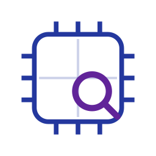
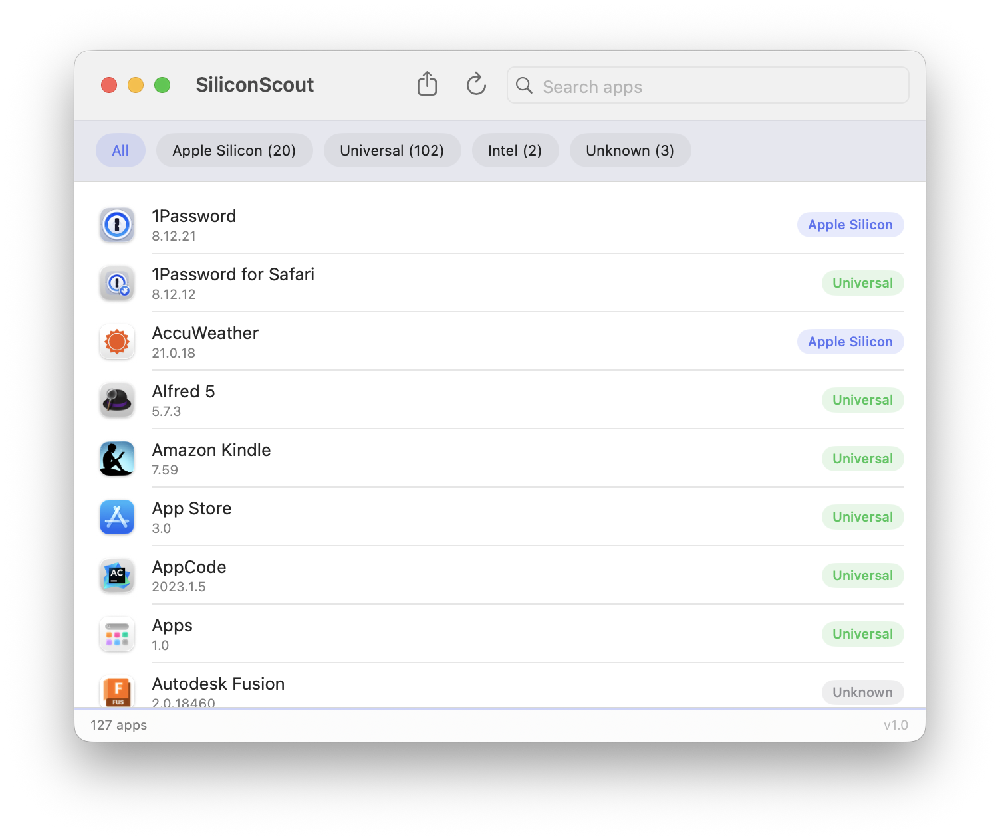

<p align="center">
  
</p>

# SiliconScout

A macOS utility that scans your installed applications and reports whether each one is **Apple Silicon** (arm64), **Intel** (x86_64, runs via Rosetta 2), or **Universal** (both).

    [](https://github.com/shaqmughal/SiliconScout/actions/workflows/ci.yml)

<p align="center">
  
</p>

## Why this matters

Apple has confirmed that **Rosetta 2 will be removed starting with macOS 28** — only a small set of older, unmaintained games will retain any Rosetta functionality after that point. Apple recommends that users *"update your Intel-based apps, plug-ins, extensions, and other add-ons for Apple silicon"* for *"optimal performance and future compatibility."*

SiliconScout helps you find which apps on your Mac are still Intel-only so you can update or replace them before support ends.

> **Source:** [Apple Support — About Rosetta and Rosetta 2](https://support.apple.com/en-us/102527)

## Download

**[Download the latest release](https://github.com/shaqmughal/SiliconScout/releases/latest)**

Unzip and drag `SiliconScout.app` to your Applications folder.

> **First launch:** macOS will block the app because it is not notarized. Open **Terminal** and run:
> ```sh
> xattr -cr ~/Downloads/SiliconScout.app
> ```
> Then double-click the app as normal. You only need to do this once. If you moved the app to `/Applications` first, adjust the path accordingly.

## Features

- Scans `/Applications`, `/System/Applications`, and `~/Applications`
- Detects Apple Silicon, Intel, Universal, and Unknown app binaries
- Handles shell-script launcher apps (e.g. JetBrains, .NET tools) by following the script to the real binary
- Filter by architecture with one click
- Search by app name
- Right-click any app for:
  - **Show in Finder** — reveals the app in Finder
  - **Get Info** — shows Kind, Version, Bundle ID, Size, Location, and dates (mirrors Finder's Get Info panel)
  - **Copy Name / Copy Path**
  - **Export All as CSV** — saves results to a `.csv` file (opens in Numbers or Excel)
- Refresh button to re-scan at any time
- Version number shown per app in the list

## How it works

For every `.app` bundle, SiliconScout reads the Mach-O CPU slices via Foundation's `Bundle.executableArchitectures`. For apps that use a shell-script launcher (common in JetBrains and .NET tools), it parses the script, resolves the real binary, and inspects it via `lipo`.

## Build from source

Requires Xcode 15 and macOS 13 or later.

```sh
git clone https://github.com/shaqmughal/SiliconScout.git
cd SiliconScout
xed .
```

Select the `SiliconScoutApp` scheme and press Run. A command-line version is also available:

```sh
swift run siliconscout
```

## Running tests

```sh
swift test
```

36 unit tests covering architecture classification, lipo fallback, script-launcher resolution, CSV formatting, and app scanning.

## License

MIT — see [LICENSE](LICENSE).
